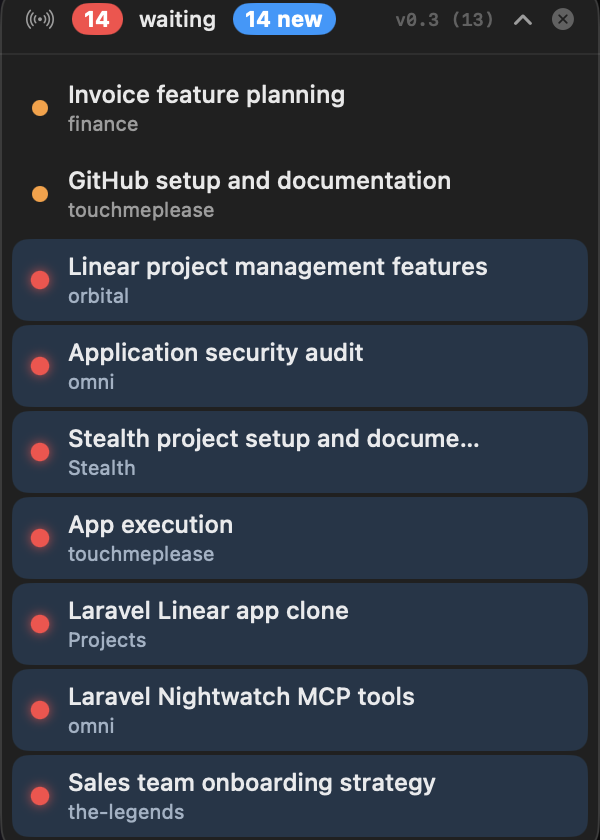

<!--
Keywords: Claude, Claude Code, Claude desktop app, macOS menu bar, floating window,
notification, waiting sessions, always-on-top, NSPanel, SwiftUI, agent app, productivity,
session monitor, AI coding assistant, Anthropic
-->

<h1 align="center">touchmeplease</h1>

<p align="center">
  <b>A tiny always-on-top macOS window that tells you which Claude chats are waiting on you.</b><br>
  Stop scrolling the Claude Code sidebar hunting for the session that asked a question.
</p>

<p align="center">
  
</p>

<p align="center">
  <a href="#install">Install</a> ·
  <a href="#how-it-works">How it works</a> ·
  <a href="#usage">Usage</a> ·
  <a href="#build-from-source">Build</a> ·
  <a href="#architecture">Architecture</a> ·
  <a href="#faq">FAQ</a>
</p>

---

## What it is

`touchmeplease` is a translucent, always-on-top floating panel for macOS that mirrors your
**[Claude desktop app](https://claude.ai/download)** chat sessions and flags their state at a glance:

| Dot | State | Meaning |
| --- | ----- | ------- |
| 🔴 | **waiting** | Claude finished its turn — **it's your move** (answer a question, approve a step) |
| 🟠 | **working** | Claude is actively running a tool or generating |
| ⚪ | **idle** | nothing happening right now |

When you run several Claude Code chats at once, it's easy to miss the one blocked on your input.
`touchmeplease` surfaces them so you always know where your attention is needed — no notifications,
no Dock icon, just a small pill that floats across every Space and fullscreen app.

The header shows a **red badge** counting how many chats are waiting, and a **blue "N new" badge**
for waiting chats you haven't looked at yet.

> **Read-only & safe:** it only *reads* Claude's on-disk session files. It never edits, deletes,
> or mutates your chats.

## Install

**Requirements:** macOS 14 (Sonoma) or later, and the [Claude desktop app](https://claude.ai/download).

### Build & install from source

No signed release is published yet — build it yourself (takes ~30s):

```bash
git clone https://github.com/vortechron/touchmeplease.git
cd touchmeplease
./bundle.sh                # release build → touchmeplease.app (unsigned)
open touchmeplease.app
```

Because the app is unsigned, the first launch may need **right-click → Open** (or
System Settings → Privacy & Security → *Open Anyway*) to get past Gatekeeper.

To keep a copy in `/Applications`:

```bash
cp -R touchmeplease.app /Applications/
```

## Usage

- The panel floats on top of everything, on every Space and fullscreen app.
- **Drag** the window anywhere to reposition it — its frame is remembered between launches.
- **Click a row** to bring the Claude desktop app to the front (and mark that row as visited,
  clearing its blue "new" highlight).
- **Chevron (˄)** in the header collapses the list to a compact pill and expands it again.
- **✕** in the header quits the app.
- **⌘⌥H** toggles the panel's visibility from anywhere (global hotkey).
- **X on a row** temporarily hides that session. It reappears if the chat gets new activity or on
  the next app launch — it is *not* a delete.

Sessions that are archived, or idle for more than 8 hours, are hidden automatically to keep the
list focused on what's live.

## How it works

`touchmeplease` reads two on-disk data sources that the Claude desktop app and Claude Code CLI
already write, then derives each session's state:

1. **Session metadata** — from
   `~/Library/Application Support/Claude/claude-code-sessions/<workspace>/<session>/local_*.json`
   (title, working directory, `cliSessionId`, last activity, archived flag).
2. **Run state (the dot)** — by tailing each session's CLI transcript at
   `~/.claude/projects/<cwd-slug>/<cliSessionId>.jsonl` (the same JSONL file Claude Code writes).
   It reads only the last ~64&nbsp;KB and inspects the **last timestamped event**:
   - `assistant` with `stop_reason: end_turn` → 🔴 **waiting** (your turn)
   - `assistant` with a tool call, or a trailing `user` / `tool_result` → 🟠 **working**
   - otherwise → ⚪ **idle**

Order is **working → waiting → idle**, most-recently-active first within each group, so the chats
actively running (and the ones needing you) stay near the top.

**Live updates:** a debounced **FSEvents** watcher on both directories, plus a short safety poll,
keeps the list matching the app within about a second — chats appear, disappear, and flip
waiting↔working in near real-time.

## Build from source

```bash
swift build                 # debug build → .build/debug/touchmeplease
swift run                   # build & run the debug binary
./bundle.sh                 # release build wrapped in touchmeplease.app (unsigned)
```

It's a small Swift 6 SPM executable (macOS 14+) with no third-party dependencies and no test suite;
verification is done by building and running. See [CONTRIBUTING.md](CONTRIBUTING.md) for the
development loop, coding conventions, and the reverse-engineered domain knowledge behind the
state detection.

## Architecture

Data flow: **two on-disk Claude data sources → scan/derive → observable store → SwiftUI panel.**

```
Sources/touchmeplease/
  App.swift                     # @main NSApplication agent entry point (+ ⌘⌥H hotkey)
  Models/
    Session.swift               # immutable SessionInfo struct
    SessionState.swift          # waiting / working / idle + sort rank
    Version.swift               # version + build badge shown in the header
  Core/
    SessionScanner.swift        # local_*.json → [SessionInfo] (dedupe, filter)
    TranscriptReader.swift      # tail <cliSessionId>.jsonl → SessionState
    SessionStore.swift          # @MainActor observable merge + refresh
    DirectoryWatcher.swift      # FSEvents on both data directories (debounced)
    Focuser.swift               # brings Claude.app to the front
    AcknowledgmentStore.swift   # tracks which waiting rows you've visited ("new" badge)
    HiddenStore.swift           # per-row temporary hide (the X button)
    HotKey.swift                # Carbon global hotkey (⌘⌥H)
  UI/
    FloatingPanel.swift         # always-on-top translucent NSPanel
    ContentView.swift           # header + list + collapse
    SessionRowView.swift        # a row with a pulsing status dot
```

## FAQ

### Why doesn't clicking a row jump straight to that specific chat?

Because there's no safe way to do it. macOS has no public API to focus an existing local Claude
Code chat by id, and every `claude://` deep link is unusable for this:

- `claude://resume?session=<id>` **forks a duplicate** by re-importing the transcript.
- `claude://code/<id>` is disabled by a feature flag in current builds.
- `claude://claude.ai/chat/<uuid>` is Chat-tab only; local chats have no cloud UUID.
- The clean focus primitive (`setFocusedSession`) is internal IPC, origin-gated to Claude's own
  renderer, so an external call can't reach it.

So clicking just brings the Claude app forward and the panel mirrors its session list to make the
right row trivial to find. (Verified against Claude desktop build 2.1.187.) If Anthropic ships a
non-forking `code/<sessionId>` link or an origin-allowed local focus endpoint, jump-to-chat becomes
possible.

### Does it work with terminal / IDE CLI sessions?

It lists **desktop-app** chats. Purely terminal/IDE CLI sessions that were never opened in the
Claude desktop app aren't shown.

### Will it break when Claude updates?

It depends on Claude's on-disk session format (verified against build 2.1.187). If a future version
changes the `local_*.json` schema or the transcript layout, the scanner may need an update.

### Why the name?

The chats are waiting on you. They'd like some attention. 🥺

## Contributing

Issues and PRs welcome — see [CONTRIBUTING.md](CONTRIBUTING.md) for setup, the iteration loop, and
the non-obvious domain knowledge you need to change the state logic safely.

## License

[MIT](LICENSE) © [vortechron](https://github.com/vortechron)
